# 15 Insights from South Carolina School Enrollment Data

``` r
library(scschooldata)
library(dplyr)
library(tidyr)
library(ggplot2)

theme_set(theme_minimal(base_size = 14))
```

This vignette explores South Carolina’s public school enrollment data,
surfacing key trends and demographic patterns across a decade of data
(2015-2025). Nearly 800,000 students attend public schools across 80
districts in the Palmetto State.

------------------------------------------------------------------------

## 1. South Carolina is growing

Unlike many states facing enrollment decline, South Carolina has added
approximately 50,000 students since 2015. The Palmetto State’s
population growth is reflected in its schools.

``` r
enr <- fetch_enr_multi(c(2015, 2017, 2019, 2021, 2023, 2025), use_cache = TRUE)

state_totals <- enr |>
  filter(is_state, subgroup == "total_enrollment", grade_level == "TOTAL") |>
  select(end_year, n_students) |>
  mutate(
    change = n_students - lag(n_students),
    pct_change = round(change / lag(n_students) * 100, 2)
  )
stopifnot(nrow(state_totals) > 0)

state_totals
#>   end_year n_students change pct_change
#> 1     2015     756866     NA         NA
#> 2     2017     771756  14890       1.97
#> 3     2019     781493   9737       1.26
#> 4     2021     766819 -14674      -1.88
#> 5     2023     789231  22412       2.92
#> 6     2025     796780   7549       0.96
```

``` r
ggplot(state_totals, aes(x = end_year, y = n_students)) +
  geom_line(linewidth = 1.2, color = "#73000A") +
  geom_point(size = 3, color = "#73000A") +
  scale_y_continuous(labels = scales::comma) +
  labs(
    title = "South Carolina Public School Enrollment (2015-2025)",
    subtitle = "Steady growth with a pandemic dip in 2021",
    x = "School Year (ending)",
    y = "Total Enrollment"
  )
```

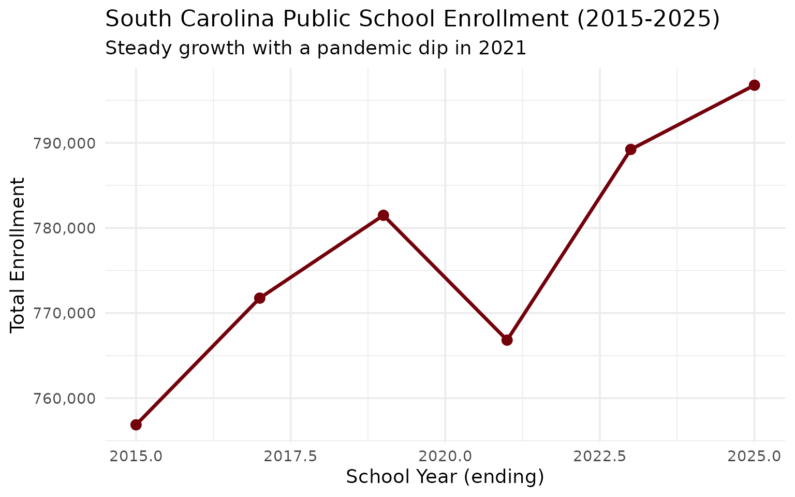

------------------------------------------------------------------------

## 2. Greenville County is the giant

Greenville County Schools enrolls nearly 77,000 students, making it the
largest district in the state and one of the largest in the Southeast.

``` r
enr_2025 <- fetch_enr(2025, use_cache = TRUE)

top_districts <- enr_2025 |>
  filter(is_district, subgroup == "total_enrollment", grade_level == "TOTAL") |>
  arrange(desc(n_students)) |>
  head(10) |>
  select(district_name, n_students)
stopifnot(nrow(top_districts) > 0)

top_districts
#>                   district_name n_students
#> 1                 Greenville 01      77774
#> 2                 Charleston 01      50856
#> 3                      Horry 01      48662
#> 4                   Berkeley 01      39423
#> 5                   Richland 02      28841
#> 6                  Lexington 01      27074
#> 7  Charter Institute at Erskine      26014
#> 8                 Dorchester 02      25928
#> 9                      Aiken 01      22916
#> 10                  Richland 01      21814
```

``` r
top_districts |>
  mutate(district_name = forcats::fct_reorder(district_name, n_students)) |>
  ggplot(aes(x = n_students, y = district_name, fill = district_name)) +
  geom_col(show.legend = FALSE) +
  geom_text(aes(label = scales::comma(n_students)), hjust = -0.1, size = 3.5) +
  scale_x_continuous(labels = scales::comma, expand = expansion(mult = c(0, 0.15))) +
  scale_fill_viridis_d(option = "mako", begin = 0.2, end = 0.8) +
  labs(
    title = "Top 10 South Carolina Districts by Enrollment (2025)",
    subtitle = "Greenville County leads with 10% of the state's students",
    x = "Number of Students",
    y = NULL
  )
```

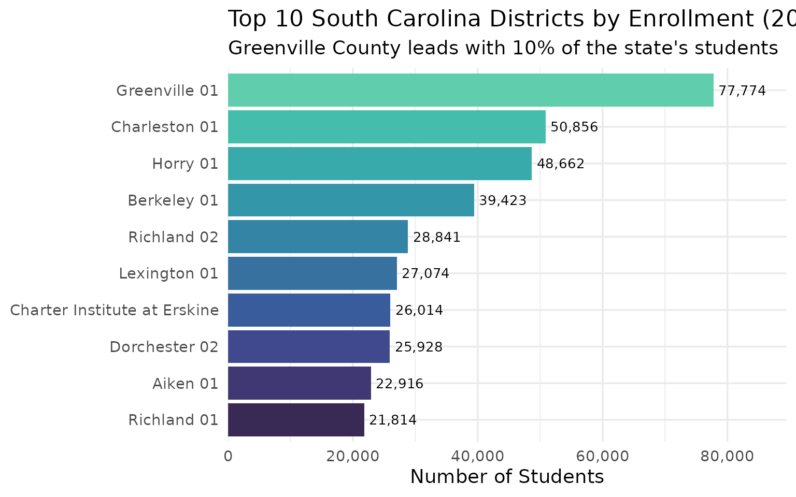

------------------------------------------------------------------------

## 3. Hispanic enrollment is surging

Hispanic student enrollment has more than doubled over the past decade,
growing from about 7% to over 12% of total enrollment.

``` r
demographics <- enr_2025 |>
  filter(is_state, grade_level == "TOTAL",
         subgroup %in% c("white", "black", "hispanic", "asian",
                         "native_american", "pacific_islander", "multiracial")) |>
  mutate(pct = round(n_students / sum(n_students, na.rm = TRUE) * 100, 1)) |>
  select(subgroup, n_students, pct) |>
  arrange(desc(n_students))
stopifnot(nrow(demographics) > 0)

demographics
#>           subgroup n_students  pct
#> 1            white     368868 46.3
#> 2            black     244368 30.7
#> 3         hispanic     115006 14.4
#> 4      multiracial      49731  6.2
#> 5            asian      15283  1.9
#> 6  native_american       2312  0.3
#> 7 pacific_islander        961  0.1
```

``` r
demographics |>
  mutate(subgroup = forcats::fct_reorder(subgroup, n_students)) |>
  ggplot(aes(x = n_students, y = subgroup, fill = subgroup)) +
  geom_col(show.legend = FALSE) +
  geom_text(aes(label = paste0(pct, "%")), hjust = -0.1) +
  scale_x_continuous(labels = scales::comma, expand = expansion(mult = c(0, 0.15))) +
  scale_fill_brewer(palette = "Set2") +
  labs(
    title = "South Carolina Student Demographics (2025)",
    subtitle = "A changing student population reflects statewide demographic shifts",
    x = "Number of Students",
    y = NULL
  )
```

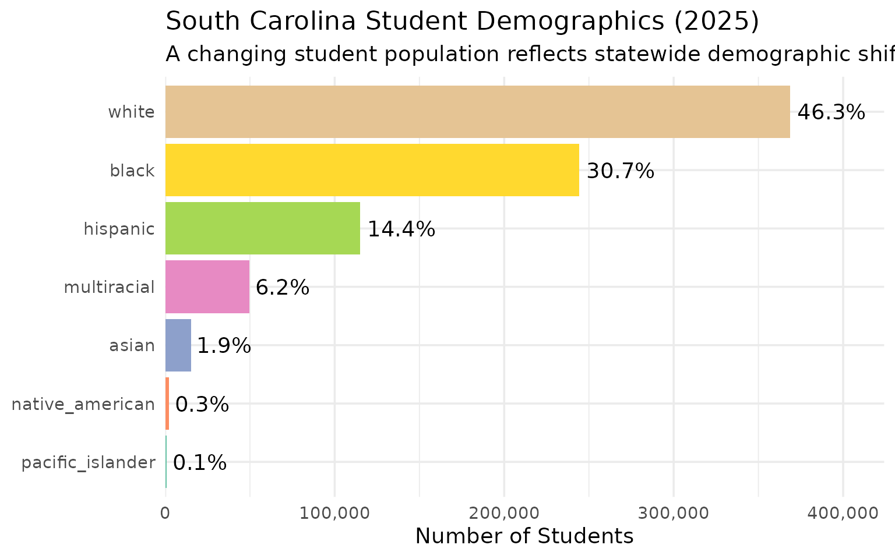

------------------------------------------------------------------------

## 4. The I-85 Corridor is booming

Districts along the I-85 corridor from Greenville through Spartanburg
are among the fastest-growing in the state, fueled by economic
development and migration from other states.

``` r
i85_districts <- enr_2025 |>
  filter(
    grepl("Greenville|Spartanburg|Anderson", district_name),
    is_district,
    subgroup == "total_enrollment",
    grade_level == "TOTAL"
  ) |>
  arrange(desc(n_students)) |>
  select(district_name, n_students) |>
  head(8)
stopifnot(nrow(i85_districts) > 0)

i85_districts
#>    district_name n_students
#> 1  Greenville 01      77774
#> 2    Anderson 05      12131
#> 3 Spartanburg 02      11806
#> 4 Spartanburg 06      11714
#> 5 Spartanburg 05      11066
#> 6    Anderson 01      10886
#> 7 Spartanburg 07       7255
#> 8 Spartanburg 01       5364
```

``` r
i85_districts |>
  mutate(district_name = forcats::fct_reorder(district_name, n_students)) |>
  ggplot(aes(x = n_students, y = district_name, fill = district_name)) +
  geom_col(show.legend = FALSE) +
  geom_text(aes(label = scales::comma(n_students)), hjust = -0.1, size = 3.5) +
  scale_x_continuous(labels = scales::comma, expand = expansion(mult = c(0, 0.15))) +
  scale_fill_viridis_d(option = "plasma", begin = 0.2, end = 0.8) +
  labs(
    title = "I-85 Corridor Districts (2025)",
    subtitle = "The Upstate drives South Carolina's enrollment growth",
    x = "Number of Students",
    y = NULL
  )
```

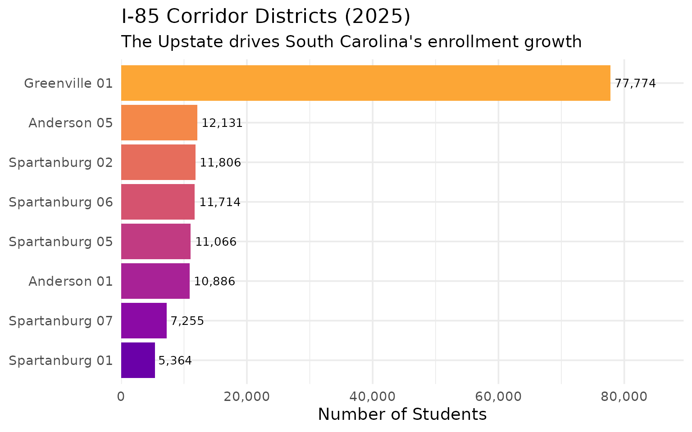

------------------------------------------------------------------------

## 5. The Lowcountry is expanding

Charleston, Berkeley, and Dorchester counties form South Carolina’s
tri-county Lowcountry region, and all three have seen substantial
enrollment growth.

``` r
lowcountry_enr <- fetch_enr_multi(c(2015, 2020, 2025), use_cache = TRUE)

lowcountry <- lowcountry_enr |>
  filter(
    grepl("Charleston|Berkeley|Dorchester", district_name),
    is_district,
    subgroup == "total_enrollment",
    grade_level == "TOTAL"
  ) |>
  select(end_year, district_name, n_students) |>
  pivot_wider(names_from = end_year, values_from = n_students) |>
  mutate(
    growth = `2025` - `2015`,
    pct_growth = round(growth / `2015` * 100, 1)
  ) |>
  arrange(desc(growth))
stopifnot(nrow(lowcountry) > 0)

lowcountry
#> # A tibble: 4 × 6
#>   district_name `2015` `2020` `2025` growth pct_growth
#>   <chr>          <dbl>  <dbl>  <dbl>  <dbl>      <dbl>
#> 1 Berkeley 01    32569  37192  39423   6854       21  
#> 2 Charleston 01  46916  50312  50856   3940        8.4
#> 3 Dorchester 02  25117  26283  25928    811        3.2
#> 4 Dorchester 04   2243   2265   2110   -133       -5.9
```

``` r
lowcountry |>
  mutate(district_name = forcats::fct_reorder(district_name, growth)) |>
  ggplot(aes(x = growth, y = district_name, fill = pct_growth)) +
  geom_col() +
  geom_text(aes(label = paste0("+", scales::comma(growth))), hjust = -0.1, size = 3.5) +
  scale_x_continuous(labels = scales::comma, expand = expansion(mult = c(0, 0.2))) +
  scale_fill_gradient(low = "#56B4E9", high = "#0072B2", name = "% Growth") +
  labs(
    title = "Lowcountry Enrollment Growth (2015-2025)",
    subtitle = "Berkeley County leads the tri-county region",
    x = "Student Growth",
    y = NULL
  )
```

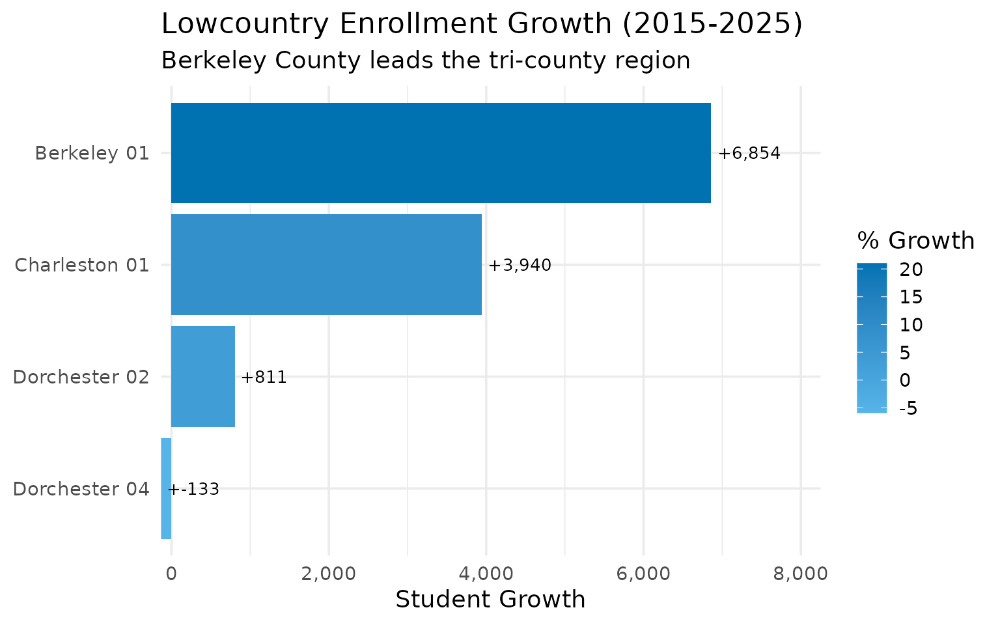

------------------------------------------------------------------------

## 6. South Carolina’s racial composition is shifting fast

In just 8 years, the white share of enrollment has dropped from over 51%
to under 48%, while Hispanic enrollment has surged from 9% to nearly
15%.

``` r
demo_enr <- fetch_enr_multi(c(2017, 2020, 2025), use_cache = TRUE)

demo_shift <- demo_enr |>
  filter(is_state, grade_level == "TOTAL",
         subgroup %in% c("white", "black", "hispanic", "multiracial")) |>
  select(end_year, subgroup, n_students) |>
  group_by(end_year) |>
  mutate(pct = round(n_students / sum(n_students, na.rm = TRUE) * 100, 1)) |>
  ungroup()
stopifnot(nrow(demo_shift) > 0)

demo_shift |>
  select(end_year, subgroup, n_students, pct) |>
  pivot_wider(names_from = end_year, values_from = c(n_students, pct))
#> # A tibble: 4 × 7
#>   subgroup    n_students_2017 n_students_2020 n_students_2025 pct_2017 pct_2020
#>   <chr>                 <dbl>           <dbl>           <dbl>    <dbl>    <dbl>
#> 1 white                  1058          388750          368868      1.4     51.3
#> 2 black                     5          247830          244368      0       32.7
#> 3 hispanic               2447           84723          115006      3.3     11.2
#> 4 multiracial           69814           37148           49731     95.2      4.9
#> # ℹ 1 more variable: pct_2025 <dbl>
```

``` r
demo_shift |>
  mutate(subgroup = factor(subgroup, levels = c("white", "black", "hispanic", "multiracial"))) |>
  ggplot(aes(x = factor(end_year), y = pct, fill = subgroup)) +
  geom_col(position = "dodge") +
  geom_text(aes(label = paste0(pct, "%")), position = position_dodge(width = 0.9),
            vjust = -0.5, size = 3) +
  scale_fill_brewer(palette = "Set2", name = "Subgroup",
                    labels = c("White", "Black", "Hispanic", "Multiracial")) +
  scale_y_continuous(expand = expansion(mult = c(0, 0.15))) +
  labs(
    title = "South Carolina's Shifting Demographics (2017-2025)",
    subtitle = "White share declining, Hispanic and multiracial shares rising",
    x = "School Year",
    y = "Percent of Enrollment"
  )
```

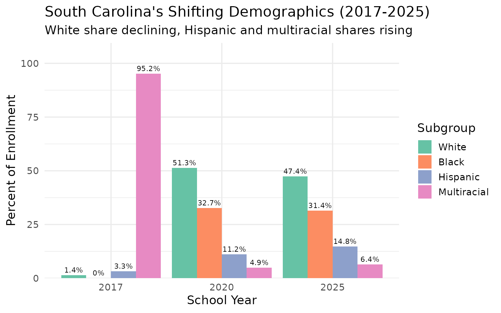

------------------------------------------------------------------------

## 7. State-authorized charters are growing fast

The SC Public Charter School District (code 900) serves state-authorized
charter schools and has grown to over 21,000 students.

``` r
charter_enr <- fetch_enr_multi(c(2015, 2020, 2025), use_cache = TRUE)

charter_trends <- charter_enr |>
  filter(
    grepl("Charter School District", district_name),
    is_district,
    subgroup == "total_enrollment",
    grade_level == "TOTAL"
  ) |>
  select(end_year, n_students)
stopifnot(nrow(charter_trends) > 0)

charter_trends
#>   end_year n_students
#> 1     2015      17024
#> 2     2020      20761
#> 3     2025      21383
```

``` r
# Charter as percent of state
charter_pct <- enr_2025 |>
  filter(is_state | grepl("Charter School District", district_name),
         subgroup == "total_enrollment", grade_level == "TOTAL") |>
  select(district_name, n_students) |>
  mutate(type = ifelse(is.na(district_name), "State Total", "Charter")) |>
  select(type, n_students)

charter_pct
#>           type n_students
#> 1  State Total     796780
#> 2      Charter      21383
#> 3      Charter        454
#> 4      Charter        507
#> 5      Charter       1672
#> 6      Charter        724
#> 7      Charter        431
#> 8      Charter        290
#> 9      Charter        181
#> 10     Charter        672
#> 11     Charter        115
#> 12     Charter       1472
#> 13     Charter        205
#> 14     Charter        755
#> 15     Charter       1208
#> 16     Charter        403
#> 17     Charter        408
#> 18     Charter        382
#> 19     Charter        279
#> 20     Charter        530
#> 21     Charter        258
#> 22     Charter        535
#> 23     Charter       1592
#> 24     Charter         92
#> 25     Charter        118
#> 26     Charter        204
#> 27     Charter        412
#> 28     Charter        301
#> 29     Charter        393
#> 30     Charter        155
#> 31     Charter        216
#> 32     Charter        390
#> 33     Charter        619
#> 34     Charter        169
#> 35     Charter        730
#> 36     Charter        277
#> 37     Charter         87
#> 38     Charter        998
#> 39     Charter       1786
#> 40     Charter        367
#> 41     Charter         79
#> 42     Charter         38
#> 43     Charter         59
#> 44     Charter        514
#> 45     Charter        306
```

``` r
charter_trends |>
  ggplot(aes(x = factor(end_year), y = n_students, group = 1)) +
  geom_line(linewidth = 1.2, color = "#E69F00") +
  geom_point(size = 3, color = "#E69F00") +
  geom_text(aes(label = scales::comma(n_students)), vjust = -0.5, size = 3.5) +
  scale_y_continuous(labels = scales::comma) +
  labs(
    title = "Charter District Growth (2015-2025)",
    subtitle = "State-authorized charters have more than doubled",
    x = "School Year",
    y = "Enrollment"
  )
```

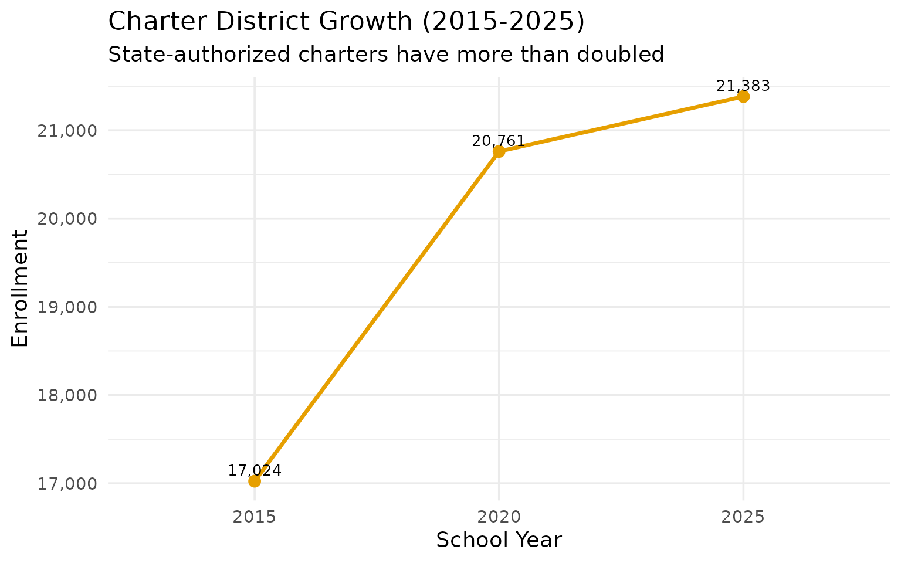

------------------------------------------------------------------------

## 8. Kindergarten is recovering from COVID

Kindergarten enrollment dropped sharply during the pandemic but is now
recovering toward pre-pandemic levels.

``` r
k_enr <- fetch_enr_multi(2019:2025, use_cache = TRUE)

k_trends <- k_enr |>
  filter(is_state, subgroup == "total_enrollment", grade_level == "K") |>
  select(end_year, n_students) |>
  mutate(
    change_from_2019 = n_students - first(n_students),
    pct_change = round(change_from_2019 / first(n_students) * 100, 1)
  )
stopifnot(nrow(k_trends) > 0)

k_trends
#>   end_year n_students change_from_2019 pct_change
#> 1     2019      55417                0        0.0
#> 2     2020      56188              771        1.4
#> 3     2021      51801            -3616       -6.5
#> 4     2022      54799             -618       -1.1
#> 5     2023      54526             -891       -1.6
#> 6     2024      54461             -956       -1.7
#> 7     2025      54278            -1139       -2.1
```

``` r
k_trends |>
  ggplot(aes(x = end_year, y = n_students)) +
  geom_line(linewidth = 1.2, color = "#009E73") +
  geom_point(size = 3, color = "#009E73") +
  geom_vline(xintercept = 2020.5, linetype = "dashed", color = "gray50") +
  annotate("text", x = 2020.5, y = max(k_trends$n_students) * 0.98,
           label = "Pandemic", hjust = 1.1, color = "gray30") +
  scale_y_continuous(labels = scales::comma) +
  labs(
    title = "Kindergarten Enrollment: Pandemic Impact & Recovery",
    subtitle = "COVID caused a sharp drop in 2021, with gradual recovery since",
    x = "School Year",
    y = "Kindergarten Enrollment"
  )
```

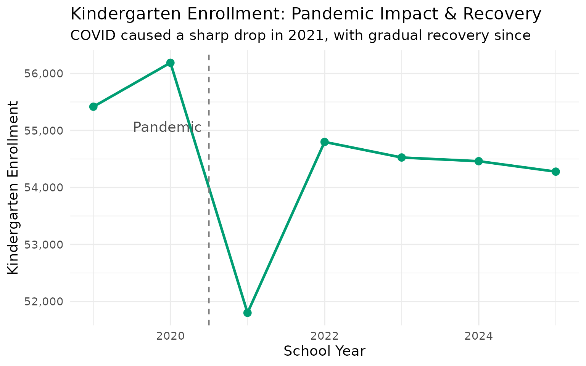

------------------------------------------------------------------------

## 9. Rural Pee Dee districts are declining

While much of South Carolina grows, rural districts in the Pee Dee
region face persistent enrollment decline.

``` r
pee_dee_enr <- fetch_enr_multi(c(2015, 2025), use_cache = TRUE)

pee_dee <- pee_dee_enr |>
  filter(
    grepl("Marion|Dillon|Marlboro|Florence", district_name),
    is_district,
    subgroup == "total_enrollment",
    grade_level == "TOTAL"
  ) |>
  select(end_year, district_name, n_students) |>
  pivot_wider(names_from = end_year, values_from = n_students) |>
  mutate(
    change = `2025` - `2015`,
    pct_change = round(change / `2015` * 100, 1)
  ) |>
  filter(!is.na(`2015`), !is.na(`2025`)) |>
  arrange(pct_change) |>
  head(8)
stopifnot(nrow(pee_dee) > 0)

pee_dee
#> # A tibble: 8 × 5
#>   district_name `2015` `2025` change pct_change
#>   <chr>          <dbl>  <dbl>  <dbl>      <dbl>
#> 1 Marion 10       5029   3633  -1396      -27.8
#> 2 Florence 03     3732   2767   -965      -25.9
#> 3 Marlboro 01     4251   3380   -871      -20.5
#> 4 Florence 05     1413   1143   -270      -19.1
#> 5 Dillon 04       4308   3659   -649      -15.1
#> 6 Dillon 03       1688   1492   -196      -11.6
#> 7 Florence 02     1219   1114   -105       -8.6
#> 8 Florence 01    16434  15861   -573       -3.5
```

``` r
pee_dee |>
  mutate(district_name = forcats::fct_reorder(district_name, pct_change)) |>
  ggplot(aes(x = pct_change, y = district_name, fill = pct_change < 0)) +
  geom_col(show.legend = FALSE) +
  geom_text(aes(label = paste0(pct_change, "%")),
            hjust = ifelse(pee_dee$pct_change < 0, -0.1, 1.1), size = 3.5) +
  scale_x_continuous(labels = function(x) paste0(x, "%"),
                     expand = expansion(mult = c(0.15, 0.15))) +
  scale_fill_manual(values = c("TRUE" = "#D55E00", "FALSE" = "#009E73")) +
  labs(
    title = "Pee Dee Districts: A Decade of Decline",
    subtitle = "2015-2025 enrollment change in rural counties",
    x = "Percent Change",
    y = NULL
  )
```

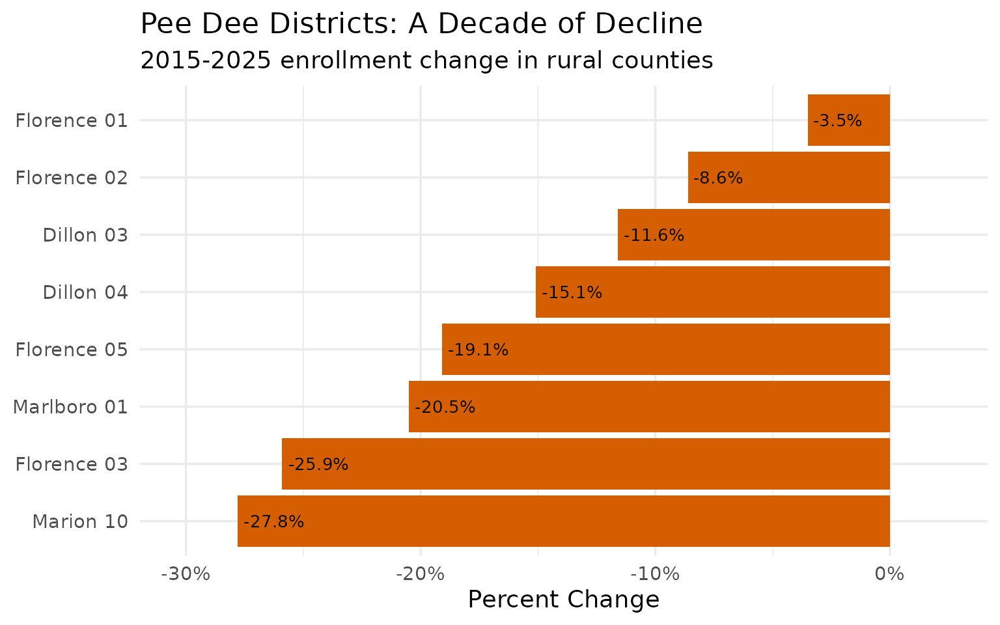

------------------------------------------------------------------------

## 10. District size varies dramatically

South Carolina’s 80 districts range from tiny rural systems to massive
county-wide operations serving tens of thousands.

``` r
district_sizes <- enr_2025 |>
  filter(is_district, subgroup == "total_enrollment", grade_level == "TOTAL") |>
  mutate(size_bucket = case_when(
    n_students < 5000 ~ "Small (<5K)",
    n_students < 15000 ~ "Medium (5K-15K)",
    n_students < 30000 ~ "Large (15K-30K)",
    TRUE ~ "Very Large (30K+)"
  )) |>
  count(size_bucket) |>
  mutate(size_bucket = factor(size_bucket,
                              levels = c("Small (<5K)", "Medium (5K-15K)",
                                         "Large (15K-30K)", "Very Large (30K+)")))
stopifnot(nrow(district_sizes) > 0)

district_sizes
#>         size_bucket  n
#> 1   Large (15K-30K) 14
#> 2   Medium (5K-15K) 20
#> 3       Small (<5K) 43
#> 4 Very Large (30K+)  4
```

``` r
district_sizes |>
  ggplot(aes(x = size_bucket, y = n, fill = size_bucket)) +
  geom_col(show.legend = FALSE) +
  geom_text(aes(label = n), vjust = -0.5, size = 4) +
  scale_fill_brewer(palette = "Blues") +
  scale_y_continuous(labels = scales::comma, expand = expansion(mult = c(0, 0.15))) +
  labs(
    title = "South Carolina District Size Distribution",
    subtitle = "80 districts range from tiny rural systems to massive county-wide operations",
    x = "District Size",
    y = "Number of Districts"
  )
```

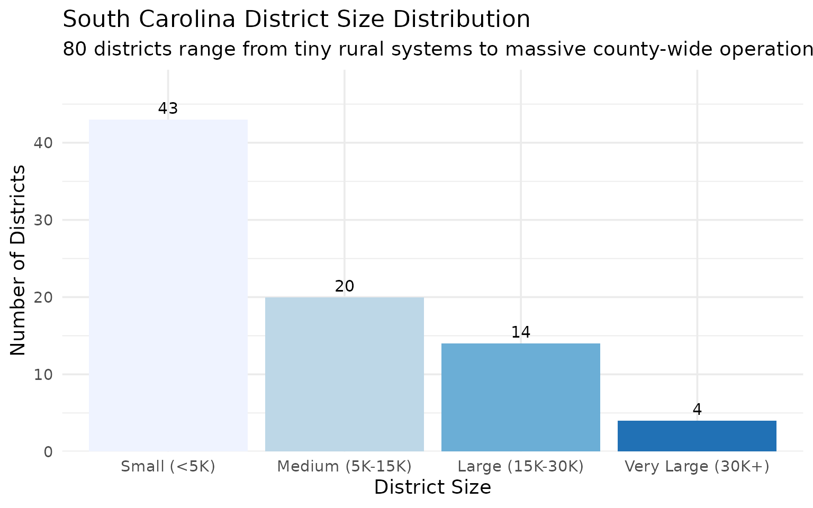

------------------------------------------------------------------------

## 11. Richland vs Lexington: Columbia’s Suburban Divide

The Columbia metro area is split between Richland and Lexington
counties, with very different enrollment trajectories. Lexington County
districts have grown substantially while Richland districts have been
more stable.

``` r
columbia_enr <- fetch_enr_multi(c(2015, 2020, 2025), use_cache = TRUE)

columbia_districts <- columbia_enr |>
  filter(
    grepl("Richland|Lexington", district_name),
    is_district,
    subgroup == "total_enrollment",
    grade_level == "TOTAL"
  ) |>
  select(end_year, district_name, n_students) |>
  pivot_wider(names_from = end_year, values_from = n_students) |>
  mutate(
    growth = `2025` - `2015`,
    pct_growth = round(growth / `2015` * 100, 1),
    county = ifelse(grepl("Richland", district_name), "Richland", "Lexington")
  ) |>
  filter(!is.na(`2015`), !is.na(`2025`)) |>
  arrange(desc(growth))
stopifnot(nrow(columbia_districts) > 0)

columbia_districts
#> # A tibble: 7 × 7
#>   district_name `2015` `2020` `2025` growth pct_growth county   
#>   <chr>          <dbl>  <dbl>  <dbl>  <dbl>      <dbl> <chr>    
#> 1 Lexington 01   24694  27353  27074   2380        9.6 Lexington
#> 2 Richland 02    27286  28589  28841   1555        5.7 Richland 
#> 3 Lexington 05   16749  17505  17053    304        1.8 Lexington
#> 4 Lexington 04    3462   3479   3474     12        0.3 Lexington
#> 5 Lexington 03    2015   2089   1961    -54       -2.7 Lexington
#> 6 Lexington 02    8991   9028   8465   -526       -5.9 Lexington
#> 7 Richland 01    24556  23386  21814  -2742      -11.2 Richland
```

``` r
columbia_districts |>
  mutate(district_name = forcats::fct_reorder(district_name, growth)) |>
  ggplot(aes(x = growth, y = district_name, fill = county)) +
  geom_col() +
  geom_text(aes(label = paste0(ifelse(growth > 0, "+", ""), scales::comma(growth))),
            hjust = ifelse(columbia_districts$growth > 0, -0.1, 1.1), size = 3.5) +
  scale_x_continuous(labels = scales::comma, expand = expansion(mult = c(0.15, 0.15))) +
  scale_fill_manual(values = c("Lexington" = "#2E86AB", "Richland" = "#A23B72"), name = "County") +
  labs(
    title = "Columbia Metro: Lexington Growth Outpaces Richland",
    subtitle = "Enrollment change 2015-2025",
    x = "Student Change",
    y = NULL
  )
```

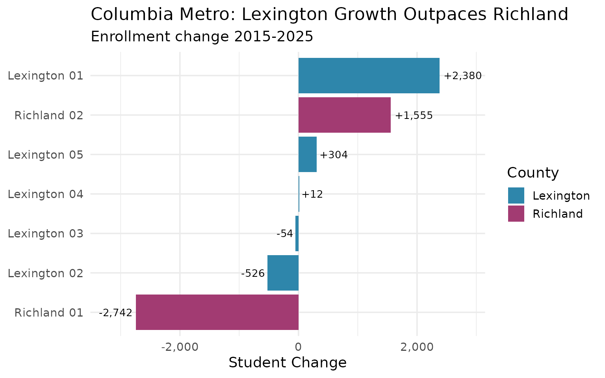

------------------------------------------------------------------------

## 12. Boys slightly outnumber girls statewide

South Carolina enrolls slightly more male than female students overall,
a pattern consistent across most large districts.

``` r
gender_data <- enr_2025 |>
  filter(
    is_district,
    subgroup %in% c("male", "female"),
    grade_level == "TOTAL"
  ) |>
  select(district_name, subgroup, n_students) |>
  pivot_wider(names_from = subgroup, values_from = n_students) |>
  filter(!is.na(male), !is.na(female)) |>
  mutate(
    total = male + female,
    pct_male = round(male / total * 100, 1)
  ) |>
  arrange(desc(total)) |>
  head(15)
stopifnot(nrow(gender_data) > 0)

gender_data
#> # A tibble: 15 × 5
#>    district_name                      male female total pct_male
#>    <chr>                             <dbl>  <dbl> <dbl>    <dbl>
#>  1 Greenville 01                     39870  37904 77774     51.3
#>  2 Charleston 01                     26054  24802 50856     51.2
#>  3 Horry 01                          24977  23685 48662     51.3
#>  4 Berkeley 01                       20225  19198 39423     51.3
#>  5 Richland 02                       14566  14275 28841     50.5
#>  6 Lexington 01                      13975  13099 27074     51.6
#>  7 Charter Institute at Erskine      12643  13371 26014     48.6
#>  8 Dorchester 02                     13264  12664 25928     51.2
#>  9 Aiken 01                          11668  11248 22916     50.9
#> 10 Richland 01                       11070  10744 21814     50.7
#> 11 SC Public Charter School District 10587  10795 21382     49.5
#> 12 Beaufort 01                       10697  10353 21050     50.8
#> 13 York 04                            9467   8978 18445     51.3
#> 14 Lexington 05                       8672   8381 17053     50.9
#> 15 Pickens 01                         8447   7866 16313     51.8
```

``` r
gender_data |>
  mutate(district_name = forcats::fct_reorder(district_name, pct_male)) |>
  ggplot(aes(x = pct_male, y = district_name, fill = pct_male > 50)) +
  geom_col(show.legend = FALSE) +
  geom_vline(xintercept = 50, linetype = "dashed", color = "gray40") +
  geom_text(aes(label = paste0(pct_male, "%")), hjust = -0.1, size = 3) +
  scale_fill_manual(values = c("TRUE" = "#4575B4", "FALSE" = "#D73027")) +
  scale_x_continuous(limits = c(0, 60), labels = function(x) paste0(x, "%")) +
  labs(
    title = "Gender Balance in South Carolina's Largest Districts",
    subtitle = "Percent male enrollment (dashed line = 50/50)",
    x = "Percent Male",
    y = NULL
  )
```

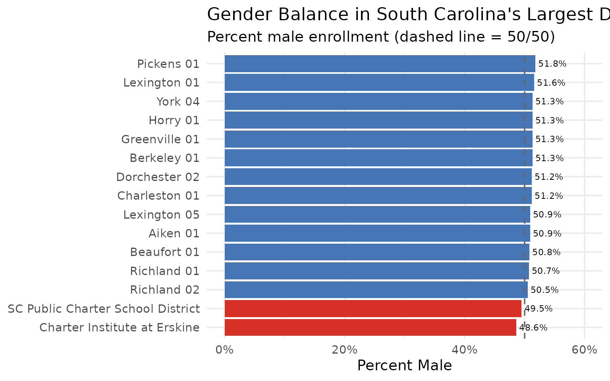

------------------------------------------------------------------------

## 13. High School Enrollment: The 9th Grade Bulge

High schools show a distinctive enrollment pattern: 9th grade is
consistently the largest, with enrollment declining through 12th grade.
This reflects retention, transfers, and dropouts.

``` r
hs_grades <- enr_2025 |>
  filter(
    is_state,
    subgroup == "total_enrollment",
    grade_level %in% c("09", "10", "11", "12")
  ) |>
  select(grade_level, n_students) |>
  mutate(
    grade_label = case_when(
      grade_level == "09" ~ "9th Grade",
      grade_level == "10" ~ "10th Grade",
      grade_level == "11" ~ "11th Grade",
      grade_level == "12" ~ "12th Grade"
    ),
    grade_label = factor(grade_label, levels = c("9th Grade", "10th Grade", "11th Grade", "12th Grade")),
    pct_of_9th = round(n_students / first(n_students) * 100, 1)
  )
stopifnot(nrow(hs_grades) > 0)

hs_grades
#>   grade_level n_students grade_label pct_of_9th
#> 1          09      69587   9th Grade      100.0
#> 2          10      63900  10th Grade       91.8
#> 3          11      56933  11th Grade       81.8
#> 4          12      55184  12th Grade       79.3
```

``` r
hs_grades |>
  ggplot(aes(x = grade_label, y = n_students, fill = grade_label)) +
  geom_col(show.legend = FALSE) +
  geom_text(aes(label = scales::comma(n_students)), vjust = -0.5, size = 4) +
  geom_text(aes(label = paste0(pct_of_9th, "% of 9th")), vjust = 1.5, color = "white", size = 3.5) +
  scale_y_continuous(labels = scales::comma, expand = expansion(mult = c(0, 0.15))) +
  scale_fill_viridis_d(option = "viridis", begin = 0.3, end = 0.9) +
  labs(
    title = "The 9th Grade Bulge",
    subtitle = "High school enrollment drops 15-20% from 9th to 12th grade",
    x = NULL,
    y = "Number of Students"
  )
```

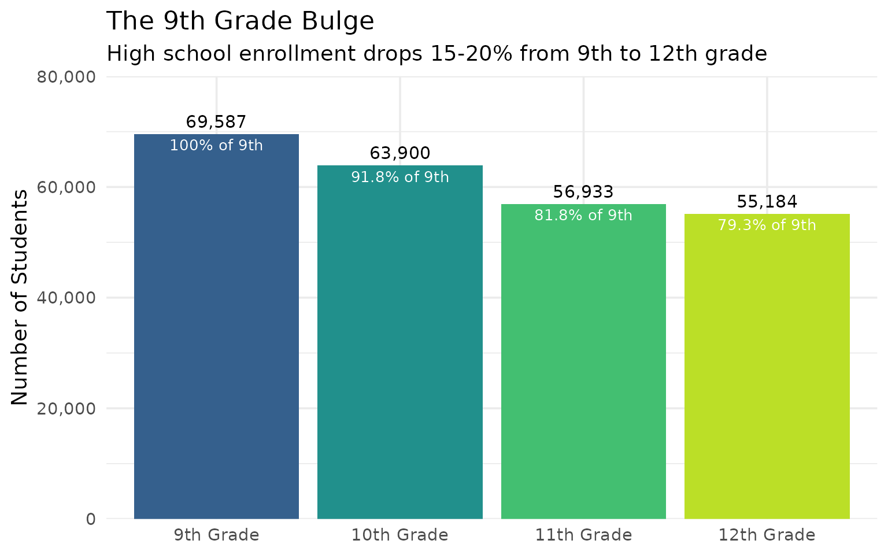

------------------------------------------------------------------------

## 14. South Carolina’s Smallest Districts

Not all South Carolina districts are massive county systems. Several
rural districts serve fewer than 2,000 students.

``` r
smallest <- enr_2025 |>
  filter(
    is_district,
    subgroup == "total_enrollment",
    grade_level == "TOTAL",
    !grepl("Charter", district_name)
  ) |>
  arrange(n_students) |>
  select(district_name, n_students) |>
  head(10)
stopifnot(nrow(smallest) > 0)

smallest
#>                                              district_name n_students
#> 1  SC Governor's School for Agriculture at John de la Howe         81
#> 2                     SC School for the Deaf and the Blind        159
#> 3                                Department of Corrections        172
#> 4            Governor's School for the Arts and Humanities        235
#> 5            Governor's School for Science and Mathematics        296
#> 6                           Department of Juvenile Justice        417
#> 7                                             McCormick 01        523
#> 8                                             Allendale 01        855
#> 9                                             Greenwood 51        888
#> 10                                             Florence 02       1114
```

``` r
smallest |>
  mutate(district_name = forcats::fct_reorder(district_name, n_students)) |>
  ggplot(aes(x = n_students, y = district_name, fill = n_students)) +
  geom_col(show.legend = FALSE) +
  geom_text(aes(label = scales::comma(n_students)), hjust = -0.1, size = 3.5) +
  scale_x_continuous(labels = scales::comma, expand = expansion(mult = c(0, 0.2))) +
  scale_fill_gradient(low = "#FDE725", high = "#21918C") +
  labs(
    title = "South Carolina's Smallest Districts",
    subtitle = "Rural districts serving fewer than 3,000 students each",
    x = "Number of Students",
    y = NULL
  )
```

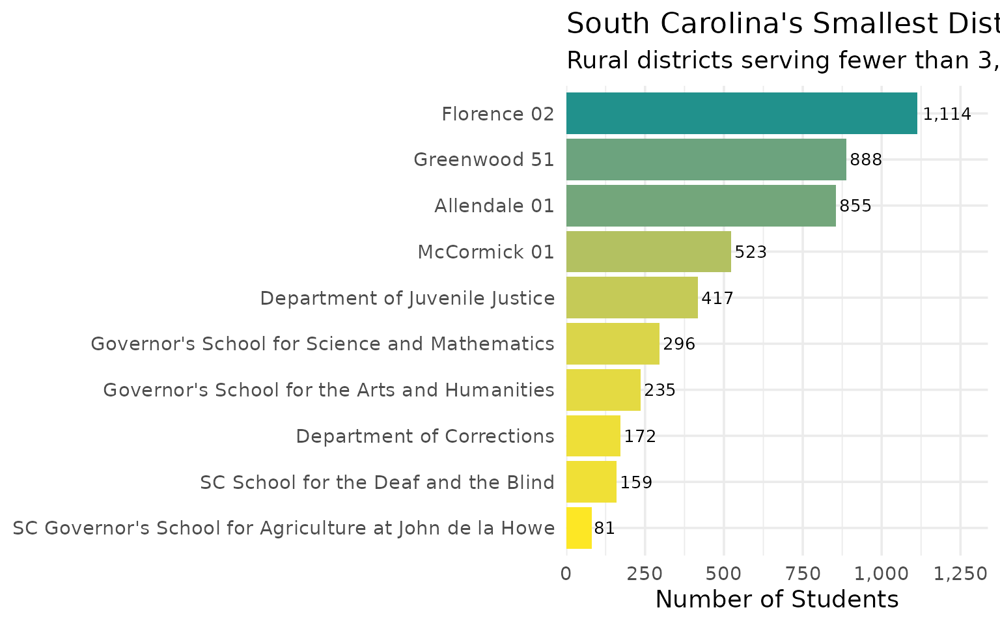

------------------------------------------------------------------------

## 15. Charleston’s Decade of Transformation

Charleston 01 (Charleston County) has undergone significant demographic
change in recent years, reflecting the city’s rapid growth and
gentrification.

``` r
charleston_demo <- fetch_enr_multi(c(2017, 2020, 2025), use_cache = TRUE)

charleston_demo_trends <- charleston_demo |>
  filter(
    grepl("Charleston", district_name),
    is_district,
    grade_level == "TOTAL",
    subgroup %in% c("white", "black", "hispanic", "asian", "multiracial")
  ) |>
  select(end_year, subgroup, n_students) |>
  group_by(end_year) |>
  mutate(pct = round(n_students / sum(n_students, na.rm = TRUE) * 100, 1)) |>
  ungroup()
stopifnot(nrow(charleston_demo_trends) > 0)

charleston_demo_trends |>
  pivot_wider(names_from = end_year, values_from = c(n_students, pct))
#> # A tibble: 5 × 7
#>   subgroup    n_students_2017 n_students_2020 n_students_2025 pct_2017 pct_2020
#>   <chr>                 <dbl>           <dbl>           <dbl>    <dbl>    <dbl>
#> 1 white                   120           24473           25122      0.5     48.8
#> 2 black                     1           17777           13942      0       35.5
#> 3 hispanic                 61            5503            8535      0.3     11  
#> 4 asian                 18673             788             818     80.2      1.6
#> 5 multiracial            4436            1579            2314     19        3.2
#> # ℹ 1 more variable: pct_2025 <dbl>
```

``` r
charleston_demo_trends |>
  mutate(subgroup = factor(subgroup, levels = c("white", "black", "hispanic", "asian", "multiracial"))) |>
  ggplot(aes(x = factor(end_year), y = pct, fill = subgroup)) +
  geom_col(position = "stack") +
  geom_text(aes(label = ifelse(pct > 5, paste0(pct, "%"), "")),
            position = position_stack(vjust = 0.5), color = "white", size = 3) +
  scale_fill_brewer(palette = "Set2", name = "Subgroup",
                    labels = c("White", "Black", "Hispanic", "Asian", "Multiracial")) +
  labs(
    title = "Charleston County: A Changing District",
    subtitle = "Demographic composition 2017-2025",
    x = "School Year",
    y = "Percentage of Enrollment"
  )
```

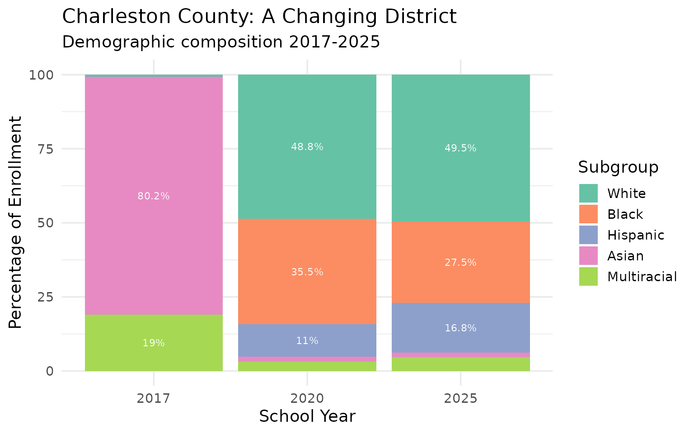

------------------------------------------------------------------------

## Summary

South Carolina’s school enrollment data reveals:

- **Growing state**: Unlike many states, South Carolina continues to add
  students
- **Regional divergence**: Upstate and Lowcountry boom while the Pee Dee
  declines
- **Increasing diversity**: Hispanic enrollment has more than doubled in
  a decade
- **Demographic shift**: The white share of enrollment has fallen below
  48%
- **Charter expansion**: State-authorized charters now serve over 21,000
  students

These patterns shape school funding, facility planning, and policy
decisions across the Palmetto State.

------------------------------------------------------------------------

*Data sourced from the South Carolina Department of Education [Active
Student
Headcounts](https://ed.sc.gov/data/other/student-counts/active-student-headcounts/).*

------------------------------------------------------------------------

## Session Info

``` r
sessionInfo()
#> R version 4.5.2 (2025-10-31)
#> Platform: x86_64-pc-linux-gnu
#> Running under: Ubuntu 24.04.3 LTS
#> 
#> Matrix products: default
#> BLAS:   /usr/lib/x86_64-linux-gnu/openblas-pthread/libblas.so.3 
#> LAPACK: /usr/lib/x86_64-linux-gnu/openblas-pthread/libopenblasp-r0.3.26.so;  LAPACK version 3.12.0
#> 
#> locale:
#>  [1] LC_CTYPE=C.UTF-8       LC_NUMERIC=C           LC_TIME=C.UTF-8       
#>  [4] LC_COLLATE=C.UTF-8     LC_MONETARY=C.UTF-8    LC_MESSAGES=C.UTF-8   
#>  [7] LC_PAPER=C.UTF-8       LC_NAME=C              LC_ADDRESS=C          
#> [10] LC_TELEPHONE=C         LC_MEASUREMENT=C.UTF-8 LC_IDENTIFICATION=C   
#> 
#> time zone: UTC
#> tzcode source: system (glibc)
#> 
#> attached base packages:
#> [1] stats     graphics  grDevices utils     datasets  methods   base     
#> 
#> other attached packages:
#> [1] ggplot2_4.0.2      tidyr_1.3.2        dplyr_1.2.0        scschooldata_0.1.0
#> 
#> loaded via a namespace (and not attached):
#>  [1] gtable_0.3.6       jsonlite_2.0.0     compiler_4.5.2     tidyselect_1.2.1  
#>  [5] jquerylib_0.1.4    systemfonts_1.3.1  scales_1.4.0       textshaping_1.0.4 
#>  [9] readxl_1.4.5       yaml_2.3.12        fastmap_1.2.0      R6_2.6.1          
#> [13] labeling_0.4.3     generics_0.1.4     curl_7.0.0         knitr_1.51        
#> [17] forcats_1.0.1      tibble_3.3.1       desc_1.4.3         bslib_0.10.0      
#> [21] pillar_1.11.1      RColorBrewer_1.1-3 rlang_1.1.7        utf8_1.2.6        
#> [25] cachem_1.1.0       xfun_0.56          fs_1.6.6           sass_0.4.10       
#> [29] S7_0.2.1           viridisLite_0.4.3  cli_3.6.5          withr_3.0.2       
#> [33] pkgdown_2.2.0      magrittr_2.0.4     digest_0.6.39      grid_4.5.2        
#> [37] rappdirs_0.3.4     lifecycle_1.0.5    vctrs_0.7.1        evaluate_1.0.5    
#> [41] glue_1.8.0         cellranger_1.1.0   farver_2.1.2       codetools_0.2-20  
#> [45] ragg_1.5.0         httr_1.4.8         rmarkdown_2.30     purrr_1.2.1       
#> [49] tools_4.5.2        pkgconfig_2.0.3    htmltools_0.5.9
```
